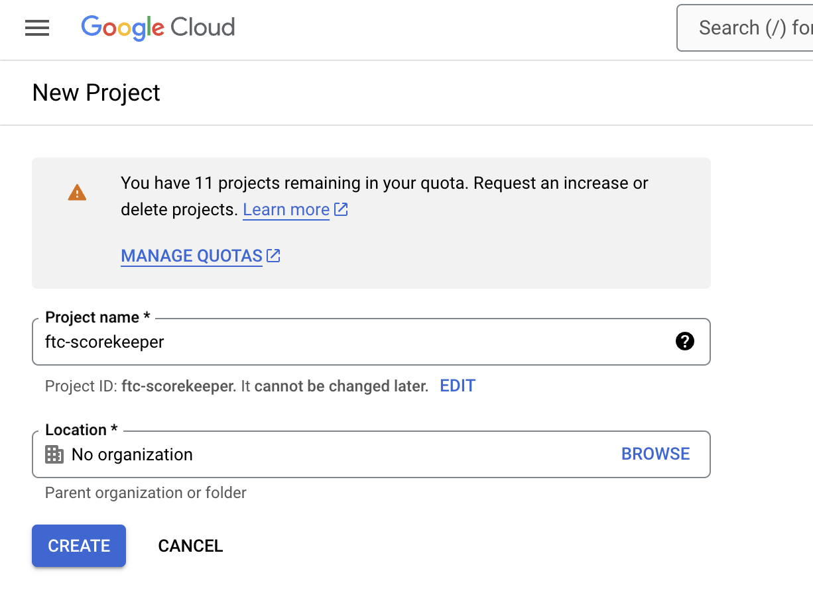
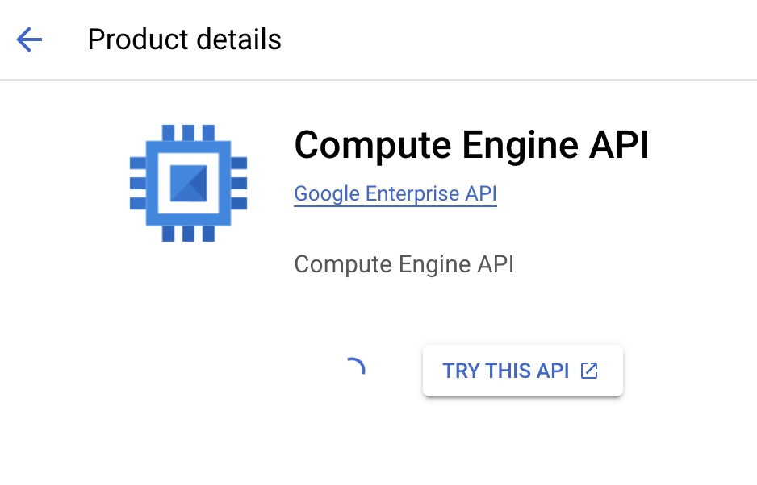
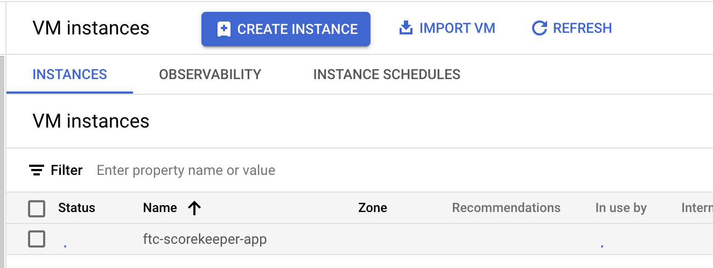
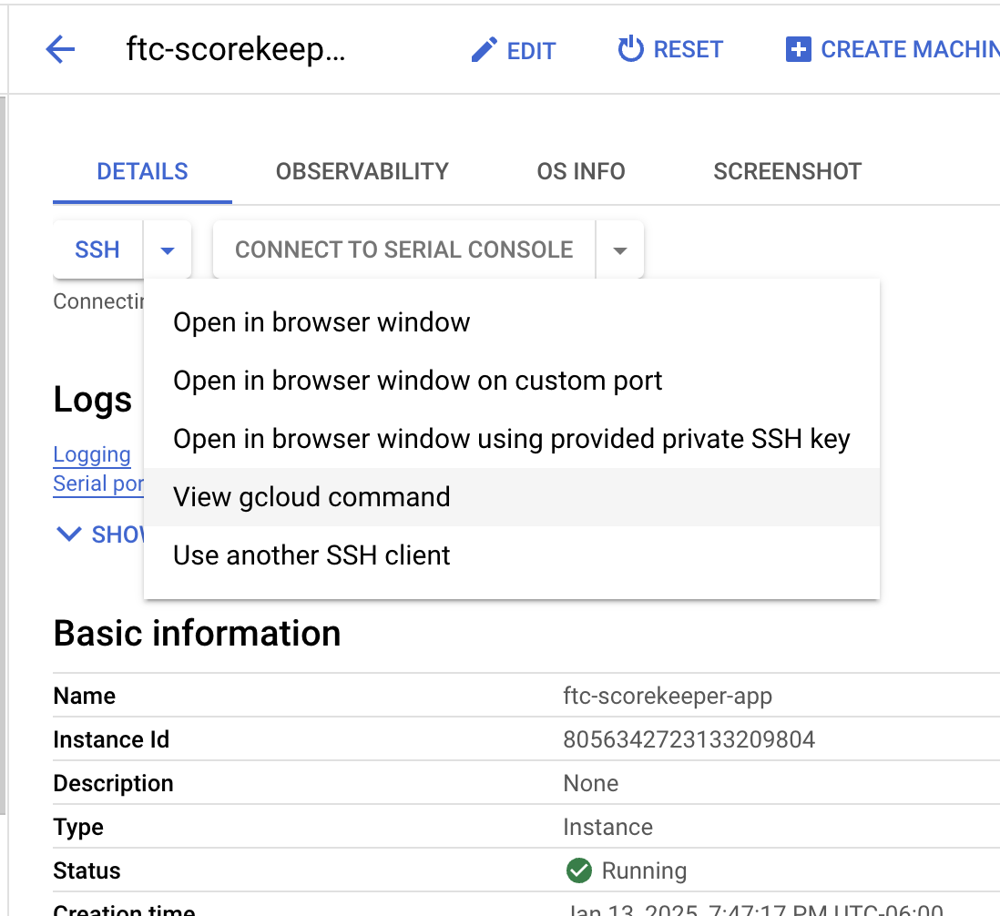
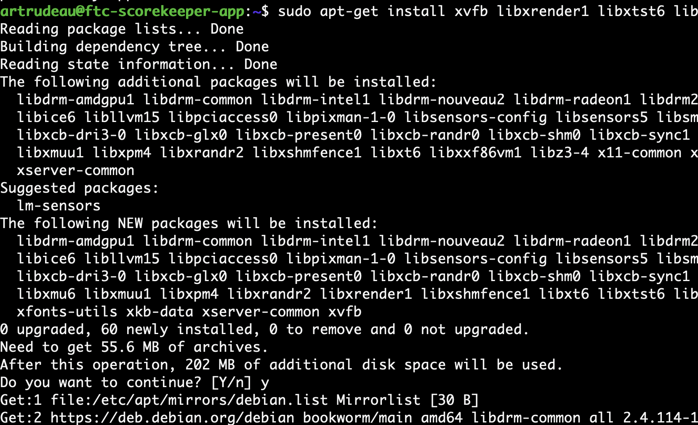
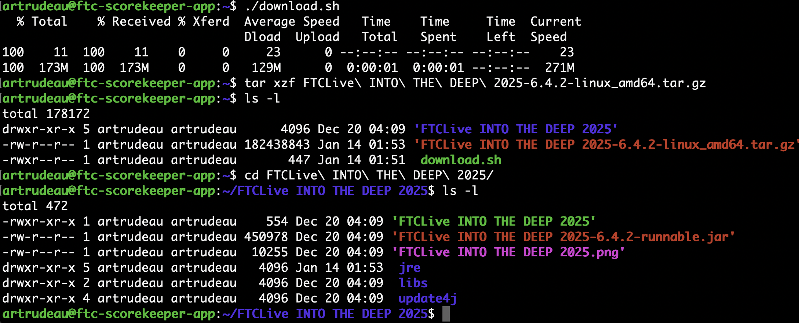
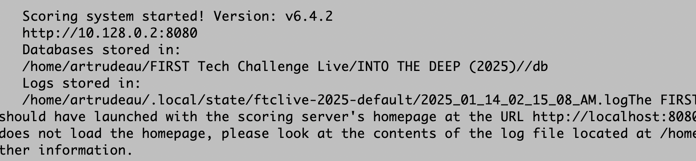
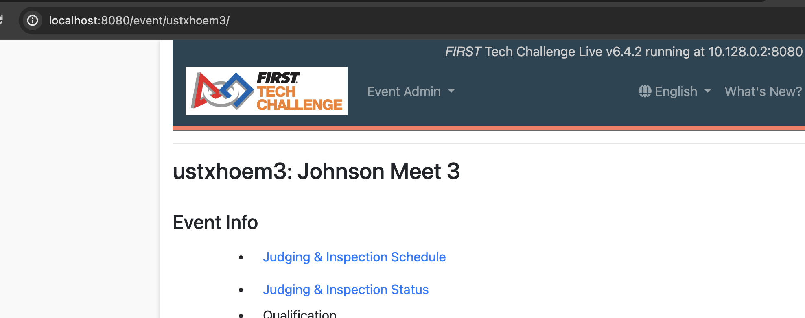
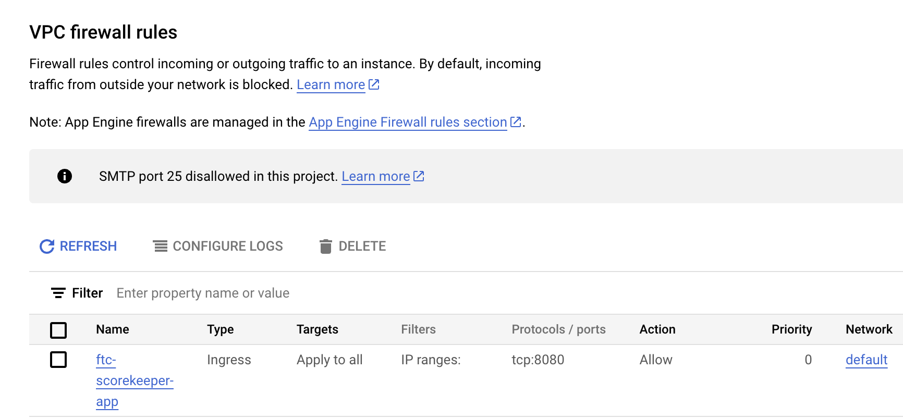
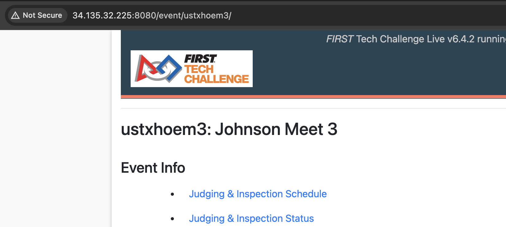

# FTC scorekeeper cloud

This document describes how to run the [FTC scorekeeper](https://github.com/FIRST-Tech-Challenge/scorekeeper) application on [Google Cloud](https://cloud.google.com/cloud-console?hl=en). Scorekeeper is a very standard Java web application. The two things slightly out of normal are that scorekeeper expects to be run with a console display and the initial login is performed from the localhost only.

## Prerequisites
1. Have a Google Cloud account with some ability to start a VM
2. Have [gcloud cli](https://cloud.google.com/sdk/docs/install) installed

## Basic Steps

1. Create a project for the VM
2. Create VM to host the application
3. Log into the VM
4. Install software to support "headless" operation

```bash
sudo apt-get install xvfb libxrender1 libxtst6 libxi6
```

5. Download and extract scorekeeper
6. Run scorekeeper

```bash
tar xzf FTCLive\ INTO\ THE\ DEEP\ 2025-6.4.2-linux_amd64.tar.gz 
cd FTCLive\ INTO\ THE\ DEEP\ 2025/;
./FTCLive\ INTO\ THE\ DEEP\ 2025 
```

7. After scorekeeper has completed its updates, close it by pressing control-c
8. Make a copy and edit the application startup script

```bash
cp FTCLive\ INTO\ THE\ DEEP\ 2025 headless-FTCLive\ INTO\ THE\ DEEP\ 2025
vim headless-FTCLive\ INTO\ THE\ DEEP\ 2025 
```

9. Change the second to last line to use xvfb-run, see the [example file](headless-FTCLive INTO THE DEEP 2025.sh)

```
xvfb-run -a -e "${SCRIPTPATH}/xvfb-run.log" "${JAVA}" ${JVMDefaultOptions} -jar "${JVMClassPath}" $@
```

10. Run the new script with nohup and and ampersand so that it will continue to run in the background even if your gcloud session is terminated

```bash
nohup ./headless-FTCLive\ INTO\ THE\ DEEP\ 2025 &
```

11. Use [ssh tunnelling](https://stackoverflow.com/questions/27294267/ssh-port-forwarding-google-compute-engine) to access the application from localhost

```bash
gcloud compute ssh --zone "us-central1-b" --project "ftc-scorekeeper" "ftc-scorekeeper-app" -- -NL 8080:localhost:8080
```

12. Using a local web browser, go to address localhost:8080 and log in using user "local" and no password. Follow the main instructions to generate your user accounts and save that information. Log out and close window. Control-c to close the port forwarding.
13. Add a firewall allow rule for port 8080, see [example file](firewall-rule.json)
14. Add a domain name 
15. Add https certificate













